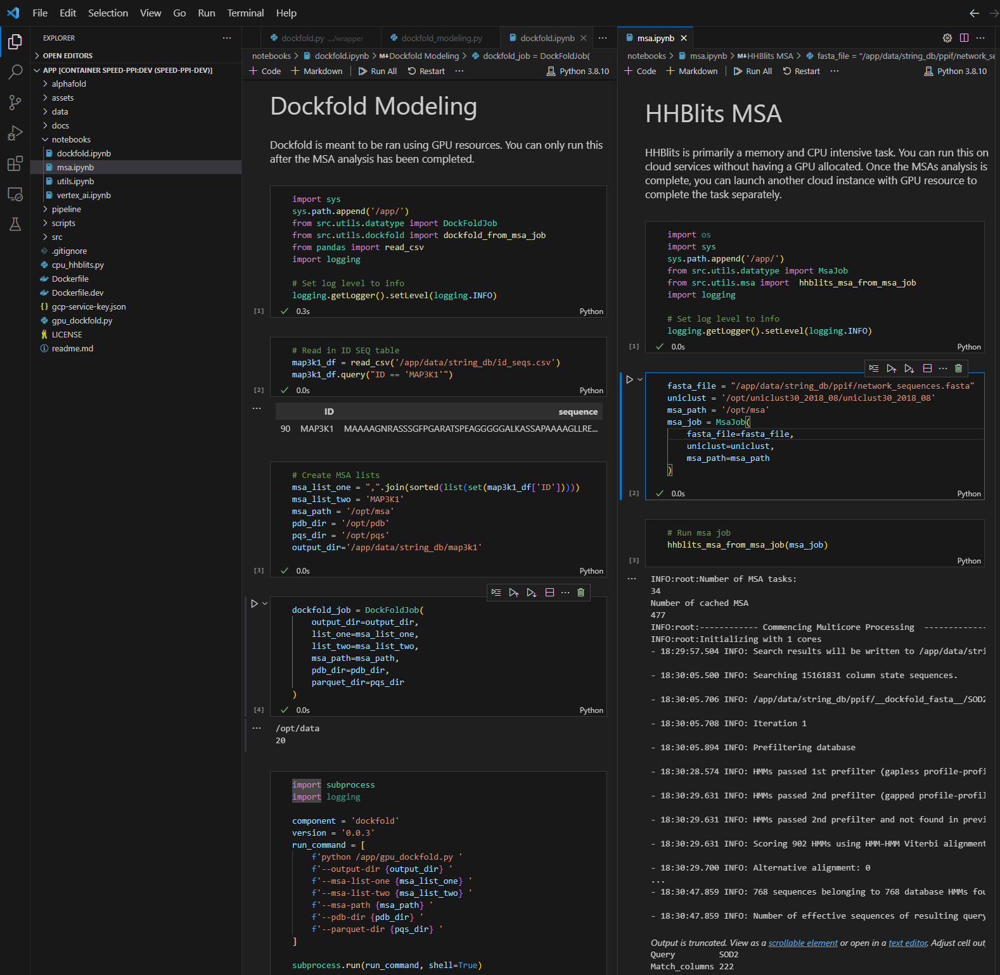

# Speed PPI

## Introduction

Welcome to the Speed PPI forked repository. Originally, [https://github.com/patrickbryant1/SpeedPPI](SpeedPPI) was developed by [https://github.com/patrickbryant1](Patrick Bryant) where the `repository contains code for predicting a pairwise protein-protein interaction network from a set of protein sequences or two lists of sequences thought to interact`. This fork is designed to facilitate the modeling and prediction of protein-protein interactions, leveraging advanced computational techniques. This fork specifically simplifies the codebase with a dockerized environment, comprehensive setup documentation, Python script wrappers, and the inclusion of custom data models using Pydantic's BaseModel. The addition of these features make this repository more portable and easier to deploy on cloud resources.

## Features

* **Dockerized Environment**: Ensuring consistent and reproducible results across various platforms.
* **Simplified Setup**: Dedicated documentation to guide you through a hassle-free setup, include the NVIDIA GPU drivers for Linux and WSL.
* **Wrapped Python Scripts**: Easy-to-use interfaces for complex computational processes.
* **Custom Data Models**: Utilizing Pydantic's BaseModel for efficient data handling and validation.

## Setup

1. **GPU Drivers**

To setup the environment with the appropriate NVIDIA GPU drivers, please follow the [GPU setup](docs/wsl2_gpu.md) instructions. Keep in mind, AlphaFold2 requires a minimum of 40GB of GPU memory to run succcessfully. Please make sure you have a card with that amount of memory to successfully run. Alternatively, setup in a cloud environment such as GCP, AWS, or Azure.

2. **Environment**

To setup your local and cloud environments, please follow the [environemnt setup](docs/setup.md) instructions. This repository is aimed at dockerized local development with JupyterNotebooks running within an IDE such as [https://code.visualstudio.com/](VSCode), [https://vscodium.com/](VSCodium), or [https://code.visualstudio.com/](PyCharm).

## Examples

### Development within Dockerized IDE
When you have followed the setup instructions, your development environment within an IDE should look as follows:



### Docker command lines

Alternatively, you can run the code through docker containers via command line.

For MSA file generation
```bash
docker run
```

For AlphaFold protein protein interaction modeling
```bash
docker run
```

## Licencing

AlphaFold2 is available under the [Apache License, Version 2.0](http://www.apache.org/licenses/LICENSE-2.0).\
SpeedPPI, which is a derivative of AlpaFold2, is available under the [Apache License, Version 2.0](http://www.apache.org/licenses/LICENSE-2.0). \
This branched repository of SpeedPPI is also available under the [Apache License, Version 2.0](http://www.apache.org/licenses/LICENSE-2.0).
